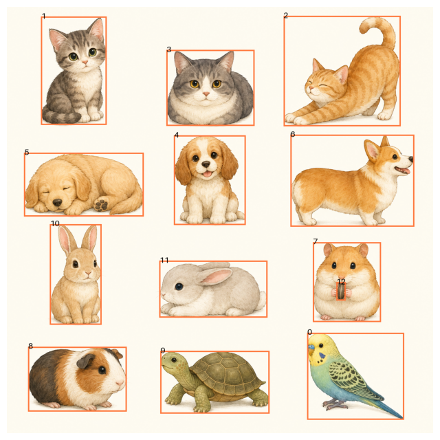
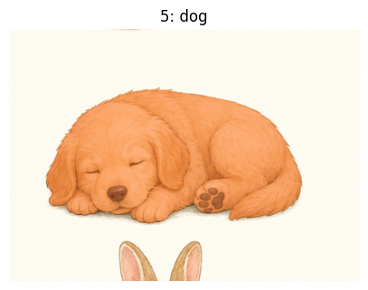
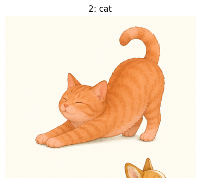

# Game Asset Extractor

A Colab notebook that turns a single AI-generated illustration into a folder of game-ready transparent PNG assets plus a `layout.json` describing where each asset sat in the original image.

It chains two open models:

- **[Grounding DINO](https://arxiv.org/abs/2303.05499)** — text-prompted, zero-shot object detection. You describe the assets you want ("mushroom", "blueberry with leaves", "pine cone"), and it returns bounding boxes.
- **[Segment Anything (SAM)](https://arxiv.org/pdf/2307.04767)** — promptable segmentation. Each Grounding DINO box is fed to SAM to produce a precise mask of the object inside it.

The masks are then refined (denoise, dilate, feather, defringe) and exported as transparent PNGs, with original canvas coordinates preserved so the assets can be re-composed into an interactive scene.

## Used in

A matching game built on top of the assets this notebook extracts:

- Live: https://match-game-two-delta.vercel.app/
- Source: https://github.com/jupiterstudio/match-game

## What it produces

```
game_extracted_assets/
├── items/                    # transparent PNG of each detected object
│   ├── mushroom.png
│   ├── mushroom_02.png
│   ├── pine_cone.png
│   └── ...
├── masks/                    # optional shadow-colored cutouts (same shape, semi-transparent)
│   ├── mushroom_mask.png
│   └── ...
└── layout.json               # canvas size + per-item id, src, x/y/width/height, bbox, score
```

`layout.json` is the contract a game scene can consume directly — every item carries its original position on the source canvas, so the extracted PNGs drop back into the same composition.

## How to use

1. Open `game_asset_extractor_colab.ipynb` in Google Colab.
2. Set the runtime to **GPU** (`Runtime → Change runtime type → GPU`).
3. Run cells top to bottom:
   - **Setup** — installs dependencies (`transformers`, `accelerate`, `opencv-python`, `pillow`).
   - **Load models** — Grounding DINO (`grounding-dino-tiny` by default) and SAM (`sam-vit-base`).
   - **Upload image** — upload one generated illustration.
   - **Define prompts** — edit `asset_prompts` with the objects you want to extract.
   - **Detect → review → segment** — visualize boxes, optionally prune or hand-edit them, then run SAM.
   - **Export** — writes `items/`, `masks/`, and `layout.json`.
   - **Download** — bundles everything as a zip.

## Example walkthrough

A run on a sheet of illustrated animals, step by step:

**1. Detect** — Grounding DINO returns a bounding box for every phrase in `asset_prompts`. The raw pass over-detects: duplicates, overlapping boxes, and the occasional false positive.



**2. Review & adjust** — prune the boxes you don't want (duplicates, low-quality, or mis-labeled detections), keeping one clean box per asset before segmenting.


**3. Segment** — each kept box is handed to SAM, which produces a precise mask of the object inside it. These cutouts are then refined and exported as transparent PNGs.




## Tuning

- **Prompts** (cell 5): one short phrase per asset, joined with periods. Visual descriptors ("berry with leaves") often beat bare nouns.
- **Detection thresholds** (cell 6): lower `box_threshold` / `text_threshold` to catch more, raise to be stricter.
- **Manual cleanup** (cell 8): drop noisy detections, rename labels, or add boxes by hand before segmentation.
- **Mask refinement** (cell 11): `expand_px`, `feather_px`, and `supersample` control edge softness; `defringe_rgba` inpaints background bleed.
- **Model size**: swap to `grounding-dino-base` and `sam-vit-large`/`sam-vit-huge` for higher quality at the cost of GPU memory.

## Why this exists

Generating a scene as one illustration is fast; cutting it into individually interactive sprites by hand is not. This notebook collapses that step into a few minutes of prompting and review, while keeping a human in the loop for the ~10% of detections that need a nudge.
